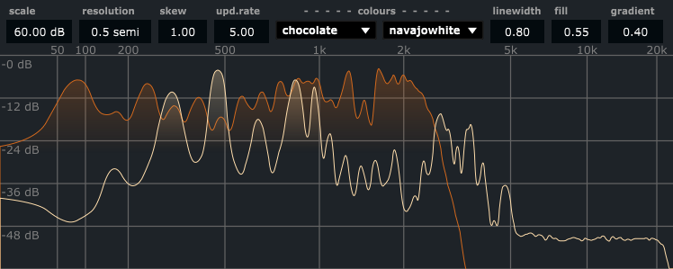

# Project Title

Spect_disp: Spectral display with SVG in Cabbage

## Description

Display frequency analysis of one or several audio signals. The analysis data is created by pvsanal (streaming phase vocoder) in Csound, and thinned/reduced to the desired display resolution. In the lower frequency range, data is already sparse, as the analysis bins are spaced linearly. When the analysis bin spacing is larger than the desired display resolution, all bins in that range will be displayed. When data is reduced, a number of bins corresponding to the display resolution are chunked together. We will then display the maximum amplitude within that chunk.

Amplitude range can be set in the range 6 to 96 dB
Resolution can be set in the range 0.1 to 4 semitones
The frequency axis can be skewed to give more space to a desired frequency range. The default skew is 1.0 which gives a somewhat logarithmic scale, but with a modified low end.
Update rate can be set in the range 5 to 50 Hz
A selection of display colours can be used for each separate audio signal.
Display tweaking can be done by adjusting line width, fill opacity, and gradient. If gradient is zero, the whole area below the line will be filled with the opacity. The gradient parameter sets the y axis point (0.0 to 1.0) where the gradient transition will occur. Using gradients can enhance display of louder signals, and also make it easier to separate several simultaneous signal displays.

## Getting Started

### Dependencies

Built with Csound 6.18 and Cabbage 2.8.38, December 2022.

### Installing and running

Download Cabbage from https://cabbageaudio.com/download/, install it.
Download the spect_display.csd file from the repo. Open it in Cabbage, adn export as VST.
Put the dll/vst file in the folder where you usually keep your plugins. Open your DAW and load the plugin on an audio track.

This is how it might look

## Help

Email me at obrandts@gmail.com, or ask around at the Cabbage forum https://forum.cabbageaudio.com/

## Authors

Øyvind Brandtsegg 2022

## License

This project is licensed under the GPL3 License - see the LICENSE.md file for details

